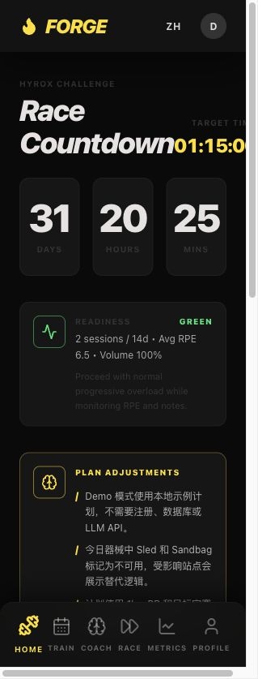
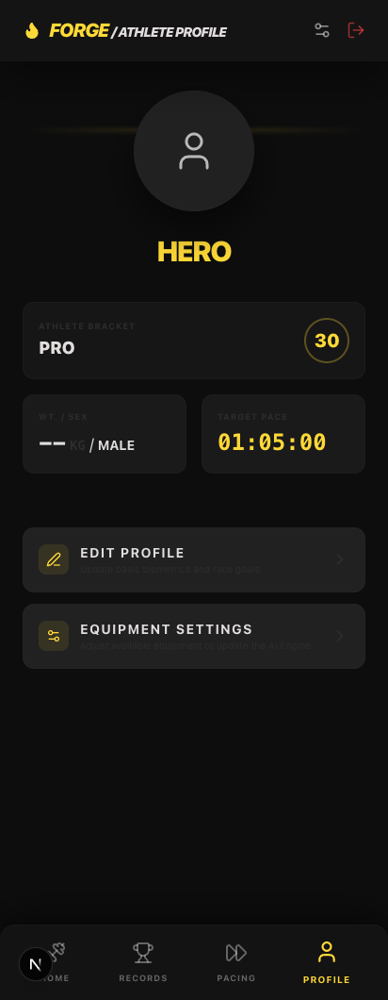
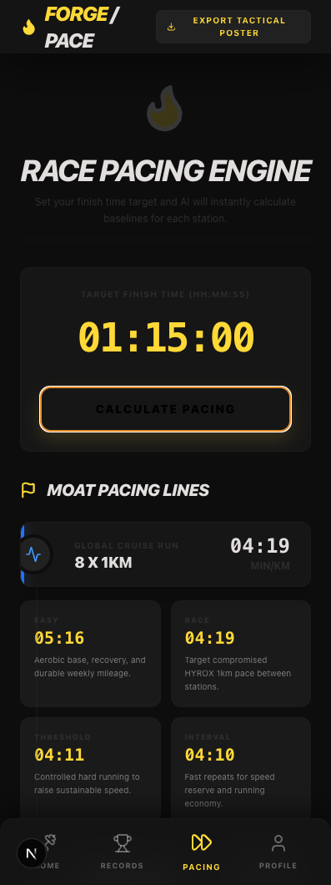
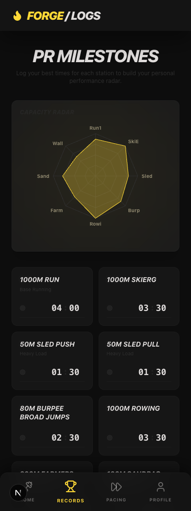

<div align="center">

# FORGE v1.0

**Your pocket AI HYROX coach**

FORGE helps HYROX athletes generate structured training plans, adapt sessions to real gym equipment, track PRs, and adjust training load from fatigue feedback.

[](https://nextjs.org)
[](https://www.typescriptlang.org)
[](LICENSE)

[Latest Update](#latest-update) · [Features](#features) · [Quick Start](#quick-start) · [Chinese 中文](#中文说明)

</div>

---

## Latest Update

**May 1, 2026 — HYROX coaching core build**

This update moves FORGE from a UI prototype toward a usable training product:

- **Coach Core guardrails**: generated microcycles are validated for seven-day structure, rest-day count, running exposure, empty training days, and unavailable equipment.
- **Equipment-aware substitutions**: workouts can detect missing equipment and create local substitutions that preserve the intended metabolic and muscular stimulus.
- **Run prescription engine**: target race time and 1km PR now produce easy, race, threshold, and interval paces used by generated running blocks.
- **Readiness feedback loop**: recent training logs, RPE, and pain/injury notes are summarized into green/yellow/red readiness states with volume guidance.
- **Database-first training state**: microcycles, edited WODs, substitutions, completed logs, PRs, profile, and equipment settings sync through the database.
- **LLM API hardening**: LLM-backed routes now require auth, return JSON 401 responses, avoid raw request-body logging, and validate/fallback generated plans.
- **Bilingual consistency**: English mode now stays English across the dashboard, workout log, equipment settings, local substitutions, and fallback-generated training plans.
- **Core tests**: added `npm run test:core` for Coach Core behavior tests.

Validation used for this update:

```bash
npm run test:core
npm run lint
npm run build
```

Current commit: `80561f9 Build HYROX coaching core`

---

## Story

Hi, I'm Mervyn, a HYROX enthusiast and AI builder.

I built FORGE because I often train while traveling, where gyms may not have HYROX-specific equipment such as sleds, SkiErgs, or wall balls. I wanted a coach in my pocket that could create a structured HYROX plan, adapt workouts to the equipment available that day, track PRs, and adjust training volume based on fatigue.

FORGE is a fan-made prototype. It is not an official HYROX application and does not use official HYROX logos or trademarks. It is intended as a training assistance tool, not a replacement for qualified coaching.

---

## Features

- **AI microcycle planning**: generate seven-day HYROX training plans from athlete profile, race date, target time, equipment, PRs, and recent fatigue.
- **Equipment substitutions**: replace sled, SkiErg, wall ball, sandbag, rower, bike, cable, dumbbell, or kettlebell work when today's gym lacks equipment.
- **Pacing engine**: calculate race, easy, threshold, and interval running paces from target finish time and running PRs.
- **Readiness state**: summarize recent logs into green/yellow/red guidance to reduce or progress training volume.
- **Workout logging**: record block results, notes, total time, and RPE.
- **PR tracking**: store benchmark results for HYROX stations and use them in planning.
- **Bilingual product experience**: switch between English and Chinese UI and generated training content.
- **Production-oriented safeguards**: authenticated APIs, normalized training data, validated LLM output, and deterministic local fallbacks.

---

## Screenshots

| Dashboard | Profile |
| :---: | :---: |
|  |  |
| **Pacing Engine** | **PR Tracker** |
|  |  |

---

## Quick Start

```bash
git clone https://github.com/mtsui-cmyk/forge-hyrox.git
cd forge-hyrox
npm install
cp .env.example .env.local
npm run dev
```

Add your LLM API key and database settings in `.env.local`.

Useful commands:

```bash
npm run test:core
npm run lint
npm run build
```

---

## Architecture Notes

- `CONTEXT.md` captures the product direction and domain language.
- `docs/STATUS.md` tracks implementation status and next vertical slices.
- `docs/adr/` records architectural decisions for LLM coaching, substitutions, and database-first state.
- `src/lib/coachGuardrails.ts` validates generated training plans.
- `src/lib/equipmentSubstitutions.ts` handles local equipment substitutions.
- `src/lib/runPrescription.ts` derives run paces.
- `src/lib/readiness.ts` summarizes fatigue/readiness.
- `tests/coach-core.test.ts` covers core coaching behavior.

---

## Disclaimer

FORGE is a training assistance tool and not medical advice. Consult a qualified coach or medical professional before starting intensive training, especially if you have pain, injury, or health concerns.

This is a fan-made personal project and is not affiliated with, endorsed by, or sponsored by HYROX.

---

<details id="中文说明">
<summary><strong>中文说明</strong></summary>

## FORGE v1.0

**你的随身 AI HYROX 训练教练**

FORGE 用来帮助 HYROX 训练者生成结构化训练计划，根据当日健身房器械情况调整训练内容，记录 PR，并根据疲劳反馈调整训练量。

### 本次更新

**2026 年 5 月 1 日 — HYROX Coaching Core**

这次更新让 FORGE 从 UI 原型更接近一个可用的训练产品：

- **Coach Core 训练守卫**：校验 7 天微周期、休息日数量、跑步训练暴露、空训练日和不可用器械。
- **器械感知替代**：当健身房缺少雪橇、SkiErg、墙球等器械时，生成保留代谢和肌肉刺激的本地替代动作。
- **跑步配速引擎**：根据目标完赛时间和 1km PR 生成 easy、race、threshold、interval 配速。
- **Readiness 状态**：根据近期训练日志、RPE 和疼痛/受伤备注生成 green/yellow/red 状态，并给出训练容量建议。
- **数据库优先状态同步**：训练计划、编辑后的 WOD、替代动作、训练日志、PR、档案和器械设置都通过数据库同步。
- **LLM API 加固**：LLM 路由需要登录鉴权，未登录返回 JSON 401，避免记录原始请求体，并校验/兜底生成计划。
- **中英文一致性**：英文模式下 Dashboard、Workout、Equipment、本地替代和 fallback 训练内容保持英文；中文模式保持中文。
- **核心行为测试**：新增 `npm run test:core`。

本次验证：

```bash
npm run test:core
npm run lint
npm run build
```

### 核心功能

- **AI 微周期规划**：根据运动员档案、比赛日期、目标时间、器械、PR 和疲劳反馈生成 7 天训练计划。
- **器械替代**：没有雪橇、SkiErg、墙球、沙袋、划船机等器械时，生成可执行替代方案。
- **配速引擎**：根据目标完赛时间和跑步 PR 计算比赛配速、轻松跑、阈值跑、间歇跑配速。
- **训练状态反馈**：根据近期日志输出 green/yellow/red 训练状态，用于调整训练容量。
- **训练打卡**：记录每个训练块的结果、备注、总时间和 RPE。
- **PR 追踪**：记录 HYROX 站点个人最好成绩，并用于后续计划生成。
- **中英文体验**：界面和生成训练内容支持英文/中文切换。

### 快速开始

```bash
git clone https://github.com/mtsui-cmyk/forge-hyrox.git
cd forge-hyrox
npm install
cp .env.example .env.local
npm run dev
```

在 `.env.local` 中填入 LLM API key 和数据库配置。

### 声明

FORGE 是训练辅助工具，不是医疗建议。进行高强度训练前，尤其是在有疼痛、伤病或健康风险时，请咨询专业教练或医生。

本项目为个人爱好作品，非 HYROX 官方应用，也不代表 HYROX 官方。

</details>

---

## License

[MIT](LICENSE)
