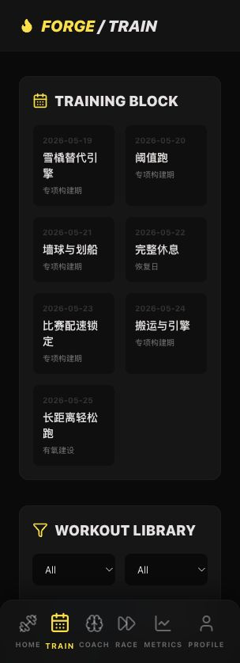
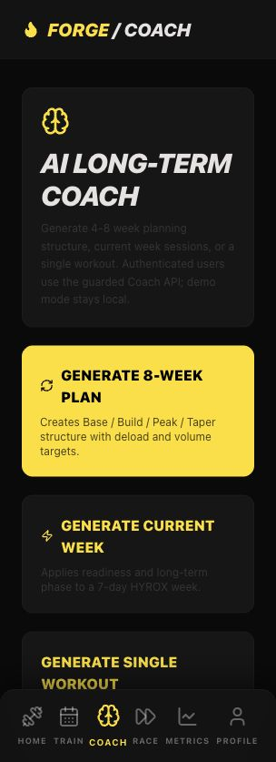
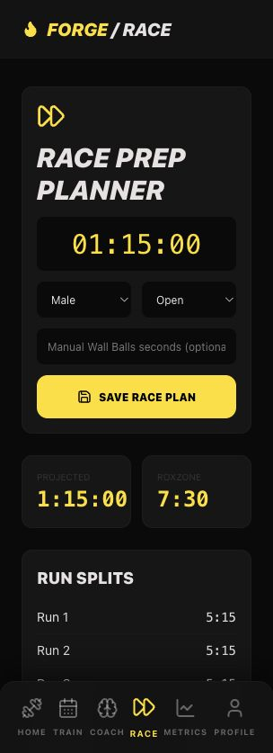
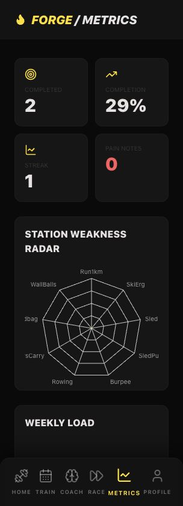
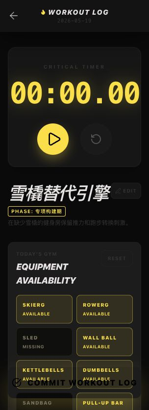

<div align="center">

# FORGE v1.4

**Your pocket AI HYROX coach and race prep planner**

FORGE helps HYROX athletes build long-term training blocks, plan weekly sessions, adapt workouts to real gym equipment, calculate race splits, track PRs, and adjust training load from fatigue feedback.

[](https://nextjs.org)
[](https://www.typescriptlang.org)
[](LICENSE)

[Latest Update](#latest-update) · [Features](#features) · [Quick Start](#quick-start) · [Chinese 中文](#中文说明)

</div>

---

## Latest Update

**May 19, 2026 — Training platform expansion**

This update expands FORGE from a seven-day coach demo into a broader Web MVP+ training product:

- **Long-term AI coach foundation**: deterministic 4-8 week plan generation with base/build/peak/taper phases, deload handling, readiness volume changes, and current-week generation.
- **Train Hub**: new `/train` workspace with the current block, 30+ HYROX workout templates, filters, scheduling, favorites-ready library data, and a manual workout builder.
- **Coach workspace**: new `/coach` entry point for long-term plans, current-week plans, and single-session generation, wired to the guarded Coach API for authenticated users.
- **Race Prep planner**: new `/race` planner for target finish time, station splits, run splits, ROXZONE estimate, manual station adjustments, and saved race plans.
- **Metrics dashboard**: new `/metrics` surface for PR weaknesses, weekly load, readiness trend, completion rate, streak, and pain-note history.
- **PostgreSQL-ready data model**: Prisma now targets PostgreSQL and includes long-term plans, training weeks, scheduled workouts, workout templates, race plans, readiness snapshots, and coach generation records.
- **Scheduled workout persistence**: Train Hub scheduling and Coach week generation now write first-class scheduled workout records while preserving legacy microcycle compatibility.
- **LLM production hardening**: generation routes now include cooldown, timeout, retry-on-transient-failure, deterministic fallback, and safe coach-generation metadata without raw prompt logging.
- **Demo continuity**: `/demo` remains public and now seeds long-term plan, library, race plan, metrics, and training data without requiring login, database writes, or LLM calls.

Validation used for this update:

```bash
npm run db:generate
npm run test:core
npm run lint
npm run build
npm run test:api
```

Try the app without creating an account:

```text
http://localhost:3000/demo
```

---

## Story

Hi, I'm Mervyn, a HYROX enthusiast and AI builder.

I built FORGE because I often train while traveling, where gyms may not have HYROX-specific equipment such as sleds, SkiErgs, or wall balls. I wanted a coach in my pocket that could create a structured HYROX plan, adapt workouts to the equipment available that day, track PRs, and adjust training volume based on fatigue.

FORGE is a fan-made prototype. It is not an official HYROX application and does not use official HYROX logos or trademarks. It is intended as a training assistance tool, not a replacement for qualified coaching.

---

## Features

- **AI long-term planning**: generate 4-8 week HYROX training blocks with phase, focus, volume target, taper, and deload logic.
- **AI microcycle planning**: generate seven-day HYROX training plans from athlete profile, race date, target time, equipment, PRs, recent fatigue, and long-term phase.
- **Train Hub and workout library**: schedule training, browse HYROX templates, filter by duration/focus/equipment, and build manual workouts.
- **Race Prep planner**: calculate run splits, station splits, ROXZONE, projected finish time, and save editable race plans.
- **Metrics dashboard**: review PR weaknesses, weekly load, readiness trend, completion rate, streak, and red-flag notes.
- **Equipment substitutions**: replace sled, SkiErg, wall ball, sandbag, rower, bike, cable, dumbbell, or kettlebell work when today's gym lacks equipment.
- **Pacing engine**: calculate race, easy, threshold, and interval running paces from target finish time and running PRs.
- **Readiness state**: summarize recent logs into green/yellow/red guidance to reduce or progress training volume.
- **Coach notes**: explain why each session was programmed and how readiness, race timing, PRs, or equipment shaped the plan.
- **Plan adjustments**: show why FORGE reduced volume, switched to fallback planning, applied taper logic, or respected missing equipment.
- **Workout logging**: record block results, notes, total time, and RPE.
- **PR tracking**: store benchmark results for HYROX stations and use them in planning.
- **Bilingual product experience**: switch between English and Chinese UI and generated training content.
- **Production-oriented safeguards**: authenticated APIs, normalized training data, validated LLM output, and deterministic local fallbacks.

---

## Screenshots

| Home | Train Hub |
| :---: | :---: |
|  |  |
| **AI Coach** | **Race Prep** |
|  |  |
| **Metrics** | **Workout Log** |
|  |  |

---

## Quick Start

```bash
git clone https://github.com/mtsui-cmyk/forge-hyrox.git
cd forge-hyrox
npm install
cp .env.example .env.local
npm run dev
```

Add your LLM API key and database settings in `.env.local`.

Useful commands:

```bash
npm run test:core
npm run lint
npm run build
npm run test:api
```

Run `npm run build` before `npm run test:api`, because the API smoke test starts the production server from `.next`.

---

## Architecture Notes

- `CONTEXT.md` captures the product direction and domain language.
- `docs/STATUS.md` tracks implementation status and next vertical slices.
- `docs/DEPLOYMENT.md` lists production environment variables and deployment checks.
- `docs/adr/` records architectural decisions for LLM coaching, substitutions, and database-first state.
- `src/lib/longTermPlan.ts` builds and validates 4-8 week HYROX training blocks.
- `src/lib/workoutLibrary.ts` contains the HYROX workout template library and filters.
- `src/lib/racePlan.ts` calculates race-day run/station splits and editable plans.
- `src/lib/metrics.ts` summarizes training load, readiness, completion, streak, and weaknesses.
- `src/lib/coachGuardrails.ts` validates generated seven-day training plans.
- `src/lib/equipmentSubstitutions.ts` handles local equipment substitutions.
- `src/lib/runPrescription.ts` derives run paces.
- `src/lib/readiness.ts` summarizes fatigue/readiness.
- `tests/coach-core.test.ts` covers core coaching behavior.
- `.github/workflows/ci.yml` runs the GitHub verification pipeline.
- `prisma/migrations/` contains the PostgreSQL database migration.

---

## Disclaimer

FORGE is a training assistance tool and not medical advice. Consult a qualified coach or medical professional before starting intensive training, especially if you have pain, injury, or health concerns.

This is a fan-made personal project and is not affiliated with, endorsed by, or sponsored by HYROX.

---

<details id="中文说明">
<summary><strong>中文说明</strong></summary>

## FORGE v1.4

**你的随身 AI HYROX 训练教练和比赛准备工具**

FORGE 用来帮助 HYROX 训练者生成长期训练周期和每周训练，根据当日健身房器械情况调整训练内容，计算比赛分段配速，记录 PR，并根据疲劳反馈调整训练量。

### 本次更新

**2026 年 5 月 19 日 — 训练平台扩展**

这次更新把 FORGE 从 7 天训练 demo 扩展成更完整的 Web MVP+ 训练产品：

- **长期 AI 教练基础**：支持 4-8 周训练周期、base/build/peak/taper 阶段、deload、readiness 降量和当前周生成。
- **Train Hub**：新增 `/train`，包含当前训练 block、30+ HYROX 模板、筛选、安排训练和手动 builder。
- **Coach 工作台**：新增 `/coach`，登录用户会走受保护的 Coach API；demo 模式仍然保持本地生成且不写数据库。
- **Race Prep**：新增 `/race`，支持目标完赛时间、8 段跑步、8 个站点、ROXZONE、手动调整和保存 race plan。
- **Metrics**：新增 `/metrics`，展示弱项、周训练负荷、readiness 趋势、完成率、连续训练和疼痛备注。
- **PostgreSQL 数据模型**：Prisma 已切换 PostgreSQL，并新增长期计划、训练周、日程训练、模板库、race plan、readiness snapshot 和 coach generation 表。
- **日程训练持久化**：Train Hub 安排训练和 Coach 当前周生成会写入 `ScheduledWorkout`，同时保留旧 microcycle 兼容。
- **LLM 生产加固**：生成路由加入 cooldown、timeout、一次瞬时失败重试、fallback 和安全元数据记录。
- **Demo 延续**：`/demo` 仍然无需注册、无需数据库写入、无需 LLM，同时包含长期计划、模板库、race plan 和 metrics 示例。

本次验证：

```bash
npm run test:core
npm run lint
npm run build
npm run test:api
```

### 核心功能

- **AI 长期规划**：生成 4-8 周 HYROX 周期，包含阶段、重点、训练量、taper 和 deload。
- **AI 微周期规划**：根据长期阶段、运动员档案、比赛日期、目标时间、器械、PR 和疲劳反馈生成 7 天训练计划。
- **Train Hub 与训练库**：安排训练、浏览 HYROX 模板、按时间/重点/器械筛选，并手动创建训练。
- **Race Prep**：计算跑步分段、站点分段、ROXZONE、预计完赛时间，并保存可编辑 race plan。
- **Metrics**：查看 PR 弱项、周训练负荷、readiness 趋势、完成率、连续训练和疼痛备注。
- **器械替代**：没有雪橇、SkiErg、墙球、沙袋、划船机等器械时，生成可执行替代方案。
- **配速引擎**：根据目标完赛时间和跑步 PR 计算比赛配速、轻松跑、阈值跑、间歇跑配速。
- **训练状态反馈**：根据近期日志输出 green/yellow/red 训练状态，用于调整训练容量。
- **教练解释**：解释每天为什么这么练，以及 readiness、比赛时间、PR 或器械如何影响计划。
- **计划调整原因**：解释为什么 FORGE 降量、切换 fallback、应用 taper 或尊重缺失器械。
- **训练打卡**：记录每个训练块的结果、备注、总时间和 RPE。
- **PR 追踪**：记录 HYROX 站点个人最好成绩，并用于后续计划生成。
- **中英文体验**：界面和生成训练内容支持英文/中文切换。

### 快速开始

```bash
git clone https://github.com/mtsui-cmyk/forge-hyrox.git
cd forge-hyrox
npm install
cp .env.example .env.local
npm run dev
```

在 `.env.local` 中填入 LLM API key 和数据库配置。

无需创建账号即可体验：

```text
http://localhost:3000/demo
```

### 声明

FORGE 是训练辅助工具，不是医疗建议。进行高强度训练前，尤其是在有疼痛、伤病或健康风险时，请咨询专业教练或医生。

本项目为个人爱好作品，非 HYROX 官方应用，也不代表 HYROX 官方。

</details>

---

## License

[MIT](LICENSE)
